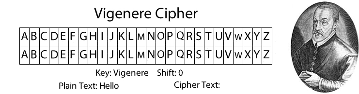
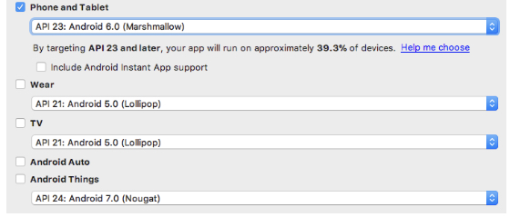
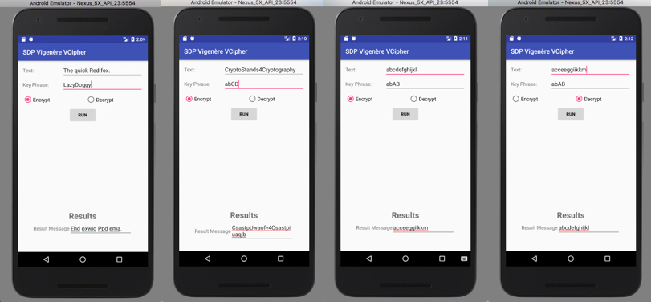
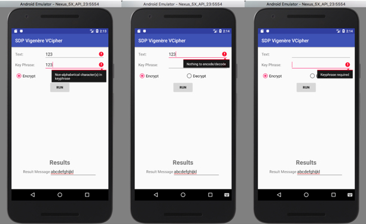

# SDP Vigenère Cipher project


This project is a simple implementation of the SDP Vigenère cipher, that shifts each letter in the original *Text* by a number of places that depends in the corresponding letter in the *Key Phrase* (0 for A, 1 for B, and so on), where the *Key Phrase* is repeated enough times to match the length of the (alphabetical) Text.
     
To illustrate with an example, below are the inputs, numeric shift applied, and output for a case in which the encrypted text is “CryptoStands4Cryptography” and the Key Phrase is “abCD”:
     
     Text:                  	CryptoStands4Cryptography
     Key Phrase (repeated): 	abCDabCDabCD abCDabCDabCD
     Numeric shift:         	012301230123 012301230123
     Output:                	CsastpUwaofv4Csastpiuaqjb
     
     Decoding works in an analogous way.
## Getting Started

These instructions will explain how to clone a copy of the project up and running on your local machine

### Prerequisites
* Preliminary reading on the [Vigenère cipher. ](https://en.wikipedia.org/wiki/Vigenère_cipher)

### Installing

* Project location is on Github. Clone the [remote master repo. ] (https://github.com/derekmegyesi/VCipher-Android-Application.git)
* Install Android Studio Version 3.0.1 (located at [Android Studio).] (https://developer.android.com/studio/index.html)
* Select API 23: Android 6.0 (Marshmallow) x86 as the target version.  Suggested device is a Nexus 5/5X.


## Running the SDP Vigenère Cipher application
* Launch Android Studio and open the project in the below directory:
	
```
./VCipher-Android-Application/VCipher
```
* Run the project by pressing ^R (Control-R).
* If running the application for the first time, the Android AVD manager will launch and prompt the user to create a virtual device.  The Nexus 5/5X is recommended as the application is streamlined for this device.
* The SDP Vigenère Cipher application will be launched in the chosen emulator.

### Inputs
* A non-empty Text to be encoded or decoded.
* The Text must contain at least one alphabetic character.
* A non-empty Key Phrase to use for the encoding or decoding.
* Radio button labeled “Encrypt” and “Decrypt”, that can be used to select whether an encryption or decryption operation is to be performed.
* *Run* button to perform the actual encryption/decryption, which produces as output the string resulting from encrypting/decrypting the provided Text using the provided Key Phrase.

### Operation
* Enter a *Text* phrase to be encryped/decrypted.
* Enter a *Keyphrase* that will be used to perform the encryption/decryption.
* Select either the *Encrypt* or *Decrypt* button (Encrypt is selected by default).
* Press the *Run* button to commence the selected operation.

## Test Cases
### Case 1: (Encrypt)
```
Text: The quick Red fox.
Keyphrase: LazyDoggy
Answer: Ehd oxwiq Ppd ema.
```

### Case 2: (Decrypt)
```
Text: acceeggiikkm
Keyphrase: LazyDoggy
Answer: abcdefghijkl
```

### Case 3: (Encrypt and Decrypt)
```
Text: abcdefghijklmnopqrstuvwxyz
Keyphrase: lemon
Encrypted answer: lforrqktwwvpybbaudggfzillk
Decrypted answer: abcdefghijklmnopqrstuvwxyz
```

### Case 4: (Encrypt and Decrypt)
```
Text: CryptoStands4Cryptography
Keyphrase: abCD
Encrypted answer: CsastpUwaofv4Csastpiuaqjb
Decrypted answer: CryptoStands4Cryptography
```

### Case 5: (Encrypt and Decrypt)
```
Text: Beware the Jabberwock, my son!
Keyphrase: VIGENERECIPHER
Encrypted answer: Wmceei klg Rpifvmeugx, qp wqv!
Decrypted answer: Beware the Jabberwock, my son!
```
## Screenshots



## References
* http://www.sanfoundry.com/java-program-implement-vigenere-cypher/
* https://stackoverflow.com/questions/38709198/case-sensitive-vigenere-cipher-produces-wrong-output